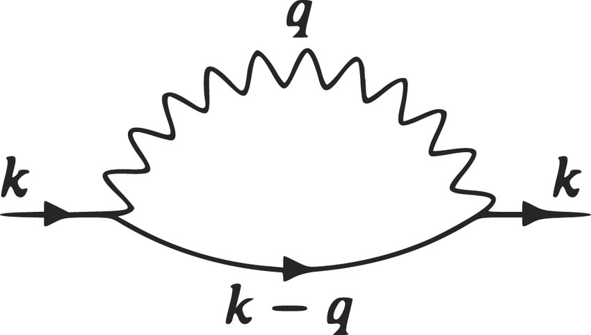

# Diagrammatic Monte Carlo for the Holstein Hamiltonian

Standalone C++17 implementation of a continuous-time Diagrammatic Monte Carlo (DiagMC) algorithm for the single-electron Holstein model.  
The code stochastically samples Feynman diagrams to estimate the imaginary-time Green’s function, extract the ground-state energy, and obtain the quasiparticle residue. No Trotter discretization is introduced.

## Overview

### Physical model

The Holstein Hamiltonian for a single electron locally coupled to dispersionless optical phonons is

```math
H = -t \sum_{\langle i,j \rangle} c_i^\dagger c_j
  + \omega_0 \sum_i b_i^\dagger b_i
  + g \sum_i c_i^\dagger c_i (b_i^\dagger + b_i)
```

where:
- t is the electron hopping amplitude
- ω₀ is the phonon frequency
- g is the electron–phonon coupling
- μ is the chemical potential
- 


### Algorithm

The code samples terms in the perturbative expansion of the single-particle Green’s function in powers of g² using a continuous-time Diagrammatic Monte Carlo scheme:

- Each diagram is represented explicitly as a doubly linked list of “vertices” (phonon emission/absorption events along the electron line) and their topology is updated dynamically. Each vertex stores:
  - imaginary time
  - phonon momentum q
  - electron momentum before and after the scattering event

- Monte Carlo updates:
  1. Add a phonon line between two imaginary times (insert two vertices)
  2. Remove an existing phonon line
  3. Stretch all vertex times to a new total propagation time τ (global rescaling)
  4. Change only the final τ without rescaling internal vertices

- Each update is accepted or rejected with a Metropolis–Hastings step. The acceptance ratio is computed analytically from free electron and phonon propagators, so no numerical integrator is needed.

- Observables accumulated during sampling:
  - histogram estimate of G(τ)
  - improved (“exact”) estimator of G(τ) with reduced binning bias
  - diagram order distribution
  - running energy estimator and blocking analysis

The ground-state energy E₀(k) is extracted from the large-τ decay of G(τ) ~ Z · exp[-(E₀(k) - μ) τ]. The prefactor Z is the quasiparticle residue.
<p align="center">
  
</p>
<p align="center"><em>
Example of a sampled electron–phonon diagram in imaginary time.
Black wavy lines represent existing phonon propagators, while red lines
illustrate a Monte Carlo “add” update — the insertion of a new phonon line
with momentum <b>q</b> between times τ′ and τ″. The electron line carries
momentum labels updated according to conservation at each vertex. From: S. Ragni, "Diagrammatic Monte Carlo for the Holstein Hamiltonian
</em></p>

## Repository structure

- DMC.cpp  
  Main Monte Carlo loop. Handles:
  - RNG setup
  - choice of update
  - Metropolis acceptance
  - histogram / estimator accumulation
  - normalization of G(τ)
  - energy estimator and blocking analysis
  Exposes:
  pair<double,double> DMC(...)

- feynmanDiagram.h / feynmanDiagram.cpp  
  Low-level diagram object (class Diag). Stores the current diagram as a linked list of Vertex objects. Provides:

- saveSimulationToFile.h / saveSimulationToFile.cpp  
  Writes run output to ./results/*.csv.

- main.cpp  
  Defines physical parameters (t, g, μ, ω₀, etc.) and Monte Carlo parameters (N steps, number of τ bins, τ cutoff), calls DMC(), prints summary, and saves results.

- analyze.py  
  Post-processing script. Reads the .csv output, plots G(τ) and the exponential fit to extract E and Z, and plots the diagram order distribution.

- Makefile  
  Builds the code into an executable and provides a `make run` target.

- results/  
  Output folder. FINAL.csv and generated plots are stored here.

## Build and run

Prerequisites:
- g++ with C++17
- Python 3 with numpy, matplotlib, scikit-learn (for analysis only)

Compile:
```
    make
```

Run the Monte Carlo simulation:
```  
  make run
```

This will:
- create ./results if missing
- build the executable
- run it once using the parameters defined in main.cpp

Output:
- ./results/FINAL.csv

Postprocess and plot:
    python3 analyze.py

This generates:
- ./results/FINAL_green_.png (G(τ) + exponential fit)
- ./results/FINAL_orders.png (diagram order distribution)

## Output content

The output .csv file contains:
- Simulation parameters  
  N, bins, g, μ, ω₀, k, t, up_lim, energyEstimator
- histogram_data  
  naive estimator of G(τ) from time histograms
- Green_estimator  
  improved estimator of G(τ) using reweighting / rescaling
- order_data  
  sampling frequency of each diagram order

From these we recover:
- G(τ) vs τ
- Ground-state energy E₀(k)
- Mean perturbation order

## Main characteristics of the code

- Continuous-time sampling.  
  τ is not discretized. Vertex times are real-valued. No Trotter error.

- Explicit diagram topology.  
  The code does not sum diagrams analytically. It walks a single diagram configuration in Markov chain space and updates it locally (add/remove phonon line, etc.).

- Exact acceptance weights.  
  getAddWeight, getRemoveWeight, getStretchWeight, getTauWeight compute the Metropolis ratios analytically using electron and phonon propagators.

- Momentum bookkeeping.  
  updateK() enforces momentum conservation along the electron line when a phonon line is inserted or removed, even if lines cross.

- Built-in error estimate.  
  The code accumulates block averages at increasing block sizes (10, 100, 1000, …) to estimate correlated-error bars on the final energy.

- Reproducibility.  
  The simulation writes both raw observables and all run parameters to disk. A run can be reproduced directly from the .csv header.

## References
E. G. Mishchenko et al., Phys. Rev. B 62, 6317 (2000).  
N. V. Prokof’ev and B. V. Svistunov, Phys. Rev. Lett. 81, 2514 (1998).   
S. Ragni, "Diagrammatic Monte Carlo for the Holstein Hamiltonian", Master’s Thesis, University of Bologna (2025).
